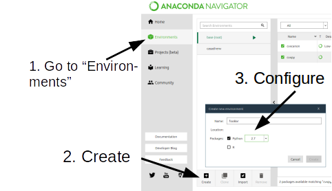
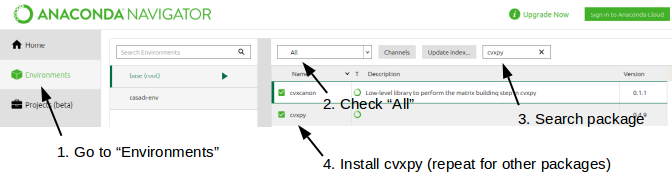
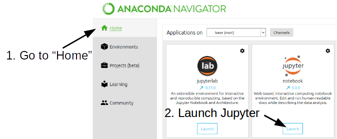

## Anaconda

After you start the anaconda navigator, do the following...

### Create a new Anaconda environment
Create a new conda environment (and activate it by clicking on the play button)

### Add a new package
From within the new environment you have created...

### Start Jupyter
Start Jupyter (you might need to install it first). This will fire up a browser window.

